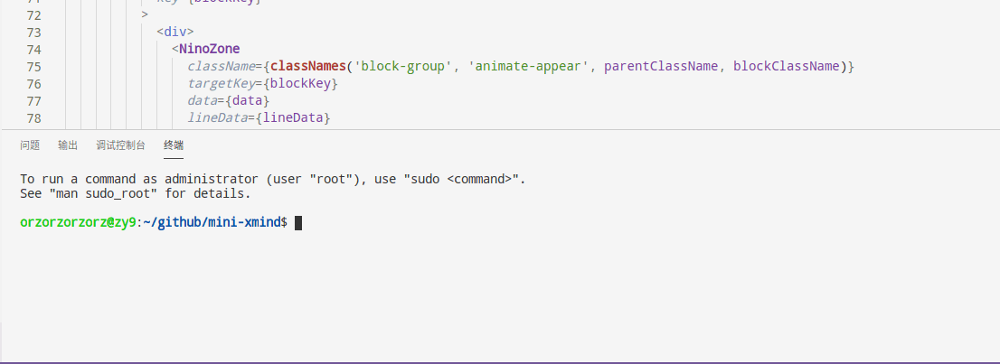

[English](./README.md) | 简体中文

# Feature

- 改善控制台输出情况，其实就是萌化，如果你也觉得输出信息不是很重要的话

- 当你按了保存等着编译的时候，可以稍微瞟一眼控制台里出现的单词。人活着就是为了背单词嘛...

- 默认的单词表是关于前端的。我看文档或者相关文章的时候，碰见不懂的单词会记下来。你也可以记一些你正在学的语言的词汇

# Usage

- 首先, 把 `git+https://github.com/orzyyyy/toho-log-plugin.git` 加到你的`package.json`，然后装上

- 然后，这是一个 webpack 的插件，所以你需要在`webpack.config.js`里配置它，就像下面写的，

```bash
  const TohoLogPlugin = require('toho-log-plugin');

  module.exports = {
    plugins: [ new TohoLogPlugin({ dev: true }) ]
  }

```

- 最后, 跑起来然后按保存的时候，你可以看到如下图所示的画面，



- 如果你用的是 webpack-dev-server, 你得设置下 `noInfo: false`, 不然你的控制台仍会输出默认编译信息

# API

| 名称         | 说明                                                                                        | 类型    | 默认值 |
| ------------ | ------------------------------------------------------------------------------------------- | ------- | ------ |
| dev          | 区分是开发环境还是生产环境, 这会影响你控制台的输出                                          | Boolean | true   |
| path         | 如果你想自定义你的单词表, 你可以这么传 { path: \_\_dirname + '/word/2017CET6-test.json' }   | string  | -      |
| defaultWords | 插件自带前端相关的单词表, 如果你懒得找，然后这个单词表又对你的胃口，可以把这个设置成 `true` | Boolean | false  |
| isPray       | 如果你在用 `webpackbar` 且你不需要显示 `watchRun` 或者 `run` 里的信息输出，你可能需要这个   | Boolean | true   |

上面 gif 里包含了着插件的所有用法，hava fun
