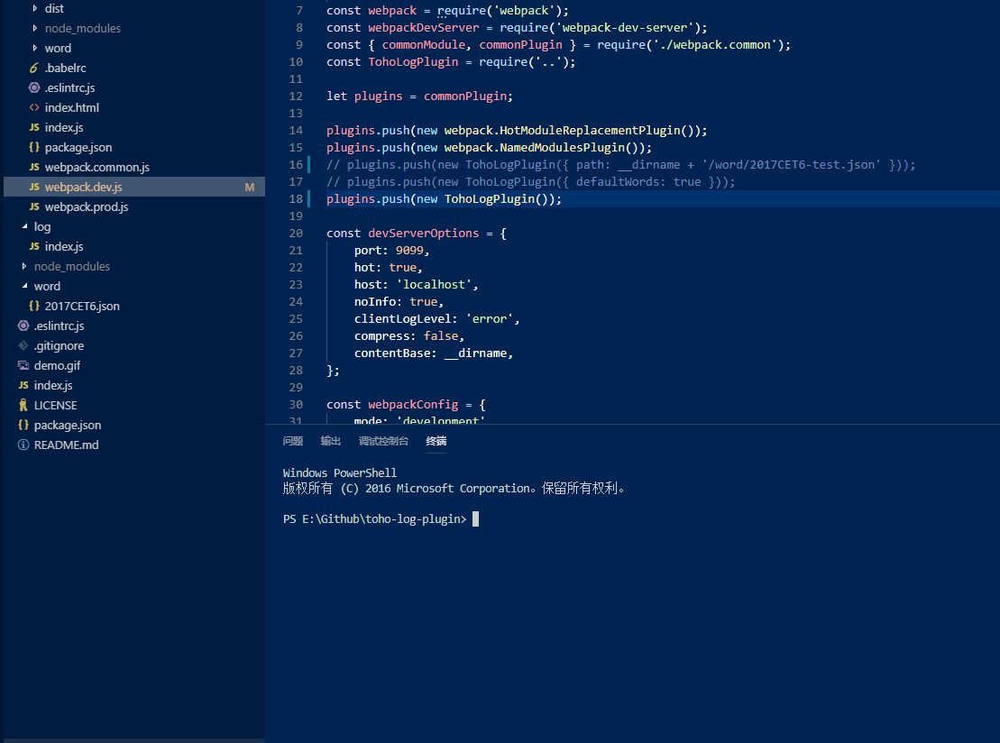

# Usage
* First, add `git+https://github.com/zy410419243/toho-log-plugin.git` into your package.json, maybe into dependencies, and install it.
  
* Then, use it as a webpack-plugin in your webpack.config.js as below,
``` bash
  const TohoLogPlugin = require('toho-log-plugin');

  module.exports = {
    plugins: [ new TohoLogPlugin() ]
  }
```
  
* Finally, when you run your webpack and save your code, you can get output of your terninel like this,
  
* If you use it in webpack-dev-server, you may need to set  `noInfo: false`, or the output will console default compile info.
  
